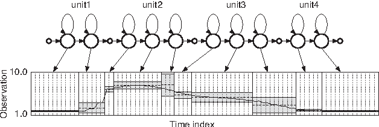
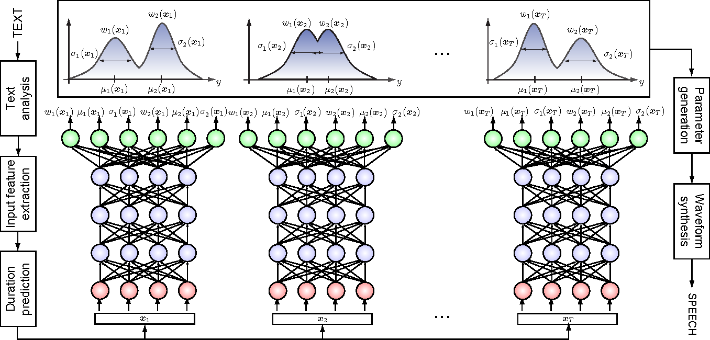
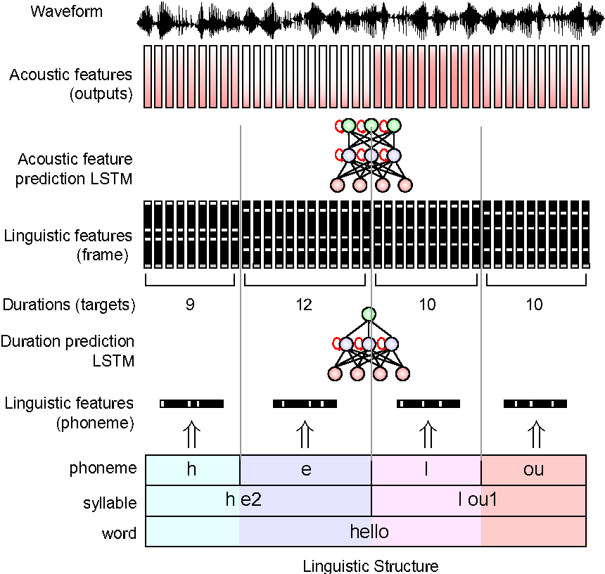
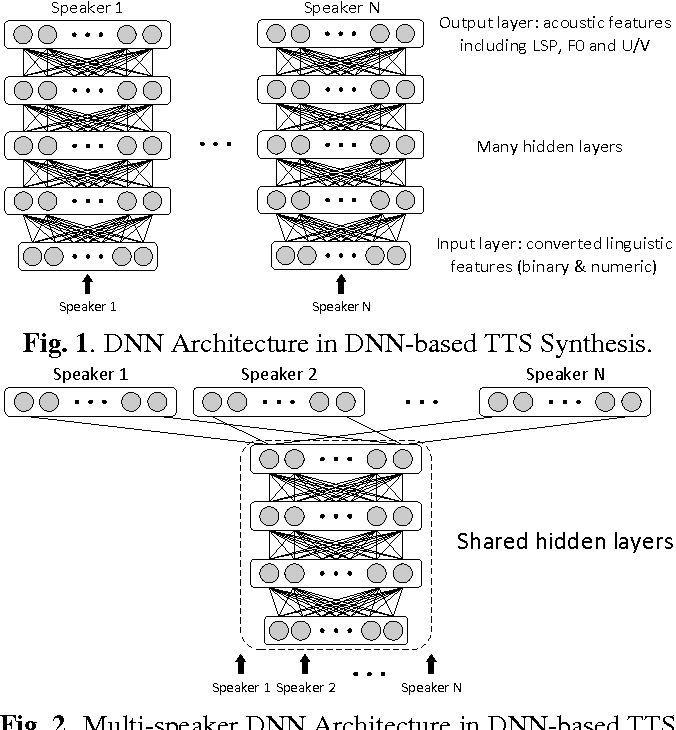
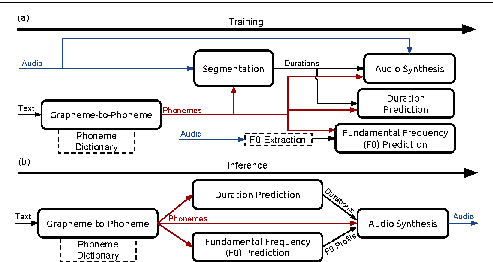
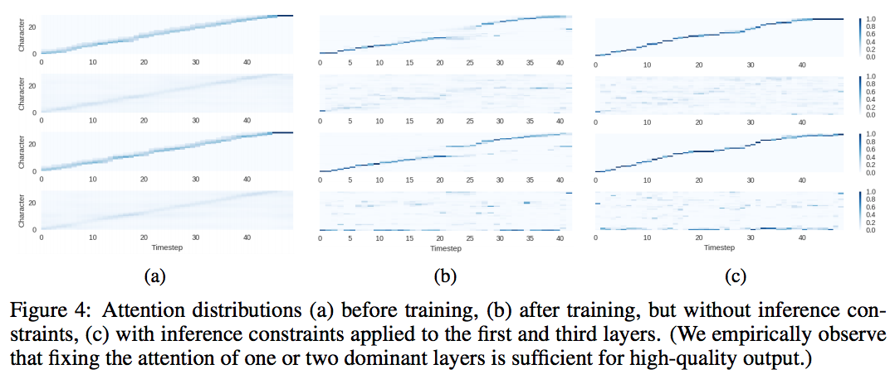
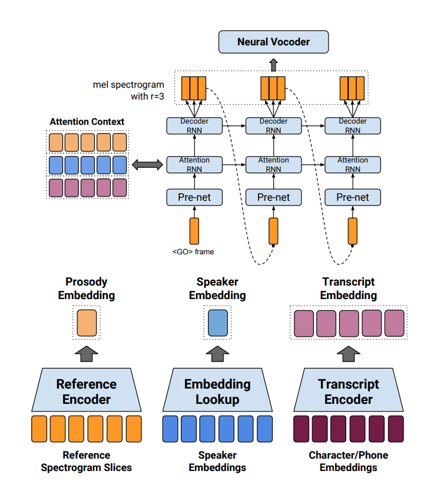

# Session 5 - 음성합성 기술의 이해와 최신 연구 동향 

- **음성합성 기술의 이해** 

  -System 

  TEXT 처리/분석 $\rightarrow$ 문자열 발음열 전환 $\rightarrow$ 음성 feature 생성  $\rightarrow$ 음성 신호 합성 / 출력 

  ex) 오늘은 날씨가 참 좋죠?(문자열/grapheme)  $\rightarrow$  오느른 날씨가 참 조초?(발음열/phoneme) *  **G2P**

  ​	 **$\rightarrow$ 음성합성 (오늘의주제)**  

#### 음성합성 기술 (Speech Synthesis Technology)

- 음성신호의 다양한 형태 

  시간 영역 - Speech waveform (전통적인 음성합성 분야에서는 시간 영역만으로는 잘 쓰이지 않는다.)

  주파수 영역 - Spectrum 

  시간-주파수 영역 - Spectrogram (전통적인 음성합성 분야에서 이것이 주로 사용되었다. )

- History 

  1. 규칙 기반의 포먼트 합성 

     전문가가 음성 생성 규칙을 공식화

     성대의 움직임을 디지털 필터로 모델링 (결과 로봇같은 소리가 난다.)

  2. 데이터 베이스기반의 연결 합성 

     음성의 조각을 녹음하여 대용량 음성 DB를 구축하여 음성 조각을 검색하고 연결 

     고품질, 자연스러운 소리 (but 연결부분, DB에 없는 단어는 부자연스러움)

     **DB가 커야 하기 때문에, 디바이스 레벨에서는 구현이 힘들다. (단점)**

  3. 데이터베이스 기반의 통계적 파라메트릭 합성 

     음성신호를 파라미터화하여 통계적으로 모델링 

     음성의 model을 가져와 합성하기 때문에, DB가 작아도 됨, 따라서 Device기반에서도 사용가능 

     DB에 없는 단어도 비교적 자연스러운 소리가 난다.

     그러나, 녹음방식이 부자연스럽다. (단점)

     $\rightarrow$ **현재의 추세 **

- Major issue in Speech Synthesis 

  1. Vocoding, Vocoder design, Acoustic Feature 

     - 고품질의 음성 신호 **합성**을 위한 Vocoder (최근 이 분야에 뉴럴넷을 많이 적용하려고 노력) 

       -> 이것에 의해 음질이 좌우 

     - 통계적 모델링에 적합한 Vocoder 

     - 음성신호의 파라미터화 ; 음성신호 생성과정을 source filter 모델로 표현 

       Excitation / spectral parameters 

     **Vocoding** 

     - Basic Vocoder 

       - Pulse or Noise (PoN) (가장 기본적인 Vocoder)

         Excitation(source) part 

         - 유성음은 주기적인 신호 존재(pulse trains)(무성음은 없음 ; white noise)\
         - Fundamental frequencey(**f0** / pitch=1/fo)

         Vocal tract (filter) part

         - Spectral parameter (ex> linear prediction coefficient ; LPC, cepstral coefficients )

     - STRAIGHT vocoder (with matlab ; 연구용이고, 무거우며, Licence 문제가 있다.)

       주파수 영역에서 원 신호의 주기/비주기 비율을 계산(band aperiodicity ; BAP)

       Pulse와 Noise 신호에 주기/비주기 비율에 따라 가중치를 주어 더함 

       결과적으로 목표는 사람의 성대에서 생성된 신호, Excitation과 동일하게 생성 

       **WORLD vocoder - 왜곡은 최소화 하면서 STRAIGHT의 계산량을 줄인 버전 - Free Software** -> 더 잘 사용됨

  2. Acoustic Modeling 

     - Acoustic Feature와 Linguistic Feature 간의 관계를 학습할 수 있는 모델 

       ex) HMM, DNN

     **HMM** ; Hidden Markov Model 기반의 음성합성 (HTS; HMM-based Speech Synthesis System)

     ; Hidden Markov - 관측된 값/ 그 안의 알수 없는 원인 

      시간에  따라 변하는 음성 신호 모델링에 적합

     $\rightarrow$ **딥러닝 기반의 음성 합성 이후에는 거의 연구 안되고 있다.**

     ​

     - 기본 HMM의 한계점 

       HMM 모델  $\lambda$ 가 주어지면, 다음 수식을 최대화하는 Acoustic feature $\omicron = [\omicron_1^T, \omicron_2^T, \cdots , \omicron^T_T]^T$ 생성

       $\rightarrow$ **모델 값이 최대가 될 때는 $\hat{\omicron}$ 이 평균이 될 때 $\rightarrow$ 궤적(Trajectory)가 끊어진다. ** 치명적, 소리가 매우 불완전

     - Trajectory HMM[Zen`07]

       Strtic feature와 dynamic feature 간의 명백한 관계를 부과 

       **-> 결과가 중요한데, 끊어지는 궤적인 이어짐** 

       

  3. Post-processing, Over-Smoothing Compensation 

     - 모델링의 부족한 부분을 보완하는 기술(ex> 훈련모델의 부적확성)
     - 합성음의 음질을 향상시킬 수 있는 기술 

     **Over-Smoothing**(과평활화 보상) 

     **훈련데이터가 부족하다거나, 데이터의 평균값이 결과 -> 단조로운 운율과 먹먹한 소리(; 고주파 대역이 왜곡된다. )**

     -Acoustic feature를 생성할 때, 문장 전체의 분산(**Global Variance**)을 고려

     >  *사진을 못찾음; 결과를 보면, 기존의 방법으로는 Natural과 비교했을 때, 파형이 매우 단조로웠지만, over-smoothing을 한 결과에서는 Natural 처럼 어느정도 복잡한 파형이 나왔다.*

* **음성합성에서의 딥러닝 기술** 

  - HMM 대신에 DBN/DNN 적용 시도

  - HMM 기반 연구에 DNN/RNN 적용 시도 

  - Acoustic Modle 구조 연구 

  - DNN 기반 음성 합성 응용 연구

  - Feature 구조 변경: **End2End TTS**

    ; 보통의 추세는 인식에서 써보고 좋으면, 음성 합성에 적용해보더라 

  **연구초기** (2013)

  - 기존의 HTS구조유지, Spectrum modeling에만 DBN적용(일부만 Deep learning 적용) , 저차원의 spectral feature 대신, 고차원의 Spectrum을 Acoustic Modeling에 바로 사용 (Microsoft`13)
  - DBN만 사용(기존의 HTS는 사용 하지 않음) (Kang`13)
  - HTS의 Feature 형식을 모방, HTS 사용하지는 않음, DNN(Vanilla NN)사용 -> **DNN기반의 음성 합성 시스템의 기본 구조가 됨** (Google`13)

  #### Acoustic Modeling 

  - DNN/LSTM/BI-LSTM (google`13)

    - 입력 linguistic feature 와 출력 Acoustic feature 간의 관계를 DNN으로 모델링 

      (HTS의 결정 트리와 GMM을 DNN으로 교체 )

    - Feature 종류 등 대부분의 HTS의 형식을 따름 

    - DNN 기반의 TTS 시스템의 기본적이고 일반적인 형탱 - baseline 이다. 

    

    	* Global variance  고려 and Acoustic features(Spectral features + Excitation features + Voice/unvoice feature)

    

     *  Duration model(하단), Acoustic model(상단), 현재 프레임의 위치정보(문맥정보) 고려

  - **Architecture**

    - 시간에 따른 모델링(Wu`16)

      - 음성신호는 시간에 대한 모델링 필요 $\rightarrow$ DNN(vanilla NN)은 frame by frame 모델링 

      - RNN 은 훈련시간이 오래 걸린다. -> **bottel neck**을 추가하고 이 레이어를 다음 인풋에 concat

        > LSTM / Bi-LSTM이 성능이 훨씬 좋다. 

    - **Multi Speaker Modeling & Speaker adaptation (Fan`15)**

      다양한 화자의 목소리를 생성하고 싶은데, 데이터가 충분치 않을때, 

      > **동일한 언어라면, 화자마다 말하는 스타일이 다를 뿐 텍스트와 음성 간의 Mapping 관계는 동일**

      

      * Speaker마다 Output layer가 따로 존재 !
      * Output layer만 따로 훈련, (5분 짜리 데이터로도 소리를 생성가능)

    - **Post-Processing** 

      훈련된 모델에서 생성된 acoustic feature $\rightarrow$ over-smoothing $\rightarrow$ 먹먹한 소리 

      GAN을 이용한 Over-Smoothing 보상 $\rightarrow$ Feature를 훨씬 sharp하게 생성 (TTS의 Post filter로 사용)

      * **이 때, Input의 형태를 시간 축, Spectrum, Spectrogram 중 어떤 input을 쓸지는 연구중**

* **최신 연구 동향** 

  두 가지의 큰 흐름 

  1. Neural Vocoder (WaveNet)
  2. End to End model (tacotron)

#### WAVENET: A Generative Model for Raw Audio 

; **Neural Vocoder** , 사람과 가장 가까운 성능, Input 형태로 **시간 축의 waveform 그대로 사용**, **1/16000의 샘플 하나를 생성.**

- 핵심은 **Causal Convolution**

  과거시간의 data $\rightarrow$ 현재 data 추정 

  긴 시간에 대해 연관성을 모델링 하기 위해(Receptive Field 확장) $\rightarrow$ **Dilated Causal Convolution 사용** 

  

  - 같은 레이어 수를 유지하고 더 넓은 범위의 연관성을 모델이 고려할 수 있게 해준다. 

- Softmax distributions 

  - 각 음성 샘플에 대한 Conditional Probability 모델링(실험적)

  - 음성 신호는 일반적으로 16bit로 양자화 되어 있음, 65536(2^16)가지의 수로 표현

  - $\mu-law$ 압축 기법을 사용하여(65536 -> 256(예시)로 줄임, 그래도 성능이 괜찮더라)

    - 데이터의 범위를 동일하지 않은 간격으로 양자화 -> 작은 값 주위는 세밀 하게, 큰 값 주위는 듬성듬성(실제로 인간은 저주파영역에서는 세밀하게 반응하고 고주파영역에서는 둔감하게 반응함) - 음성 신호는 주로 작은 값 근처에 분포

    - 256(2^8) ; 8bit 로도 꽤 괜찮은 성능의 인코딩, 압축이 가능했다. 

      

- **Gated Action Units**

  - The gated pixelCNN 방식 차용 - 영상 generation - Pixel by Pixel 단위로 영상 생성 
  - 오디오 모델링에서는  ReLU activation 보다 Gated action units이 좋다. (그러나 구조는 위를 거의 차용해서 사용했음)

- Residual, Skip Connection 

  깊은 네트워크 훈련을 가능케 하기 위해서 

- **Conditional WaveNet** 

  ; 먼저, WaveNet에서 Input으로는 Acoustic feature를 사용하거나, Text를 바로 사용할 수 있다. 

  - TTS는 입력 문장에 해당하는 음성을 합성해야 하는데, WaveNet은 문장을 인식 할 수 가 없다. 

    $\rightarrow$ 문장에 해당 하는 Condition을 제공하자!!

    - Global Conditioning 

      - 전체 시간에 대해 동일한 condition 제공 (ex> **speaker embedding** )

        $z = \tanh(W_{f,k}*\mathbf{x} + V^T_{f,k} h) \odot \sigma(W{g,k}*\mathbf{x} + V^T_{g, k}h)$

        ​	:: $h$ = a single latent representation

        ​	:: $V^T_{g,k}$ = A learnable linear projection 

    - Local Conditioning 

      - 시간에 따라 다른 Condition 제공 (ex> TTS, Linguistic feature)

        $z = \tanh(W_{f,k}*x + V_{f,k} * \mathbf{y}) \odot \sigma(W{g,k}*x + V_{g, k} * \mathbf{y})$

        ​	:: $\mathbf{y}$ = Unsampled linguistic feature 

    - [소리 예시 URL](https://deepmind.com/blog/wavenet-generative-model-raw-audio/)

- **Parallel WaveNet **

  **WaveNet의 치명적인 약점 - 1초 짜리 sample 하나 만드는데 40분 소요** 

  이를 극복하기 위해서 , 여러개의 작은 WaveNet들이 동시에 여러개(ex> 40개)의 sample을 생성한다. 

  Teacher(큰 WaveNet) - Student(작은 WaveNet들) 구조를 사용 like GAN

  $\rightarrow$ **속도 개선, 상용화 목표**

#### Tacotron

; End to End 기반의 음성 합성 시스템 , Tacotron2 - 음질 향상(Modified WaveNet), Prosodic modeling, Expresive Speech Synthesis(다양한 감정이나, 목소리 톤)

- System구조 - **Seq to Seq with Attention** 

  - 말그대로, Text(입력) to Speech(소리 출력)
  - Feature engineering 최소화 , 크게 보면, 기존의 TTS 시스템 구성과 비슷 

  

  - Generator = Vocoder
  - Encoder = text에서 feature 추출
  - Decoder = Acoustic Model 

  **Encoder**

  - Text를 sequential feature 로 표현 (발음열 변환 + 언어 Feature 추출)

  - **CBHG** 모듈

    Multi layer RNN encoder에 비해 발음 오류(오차)가 적다. 

    

    Encoder구조의 자세한 사항은 [논문 참조](https://arxiv.org/abs/1703.10135); 한번 공부해 볼 가치가 있다. 

    * Full-Context Label 

      - Phoneme (음소)

        현재 / 이웃한 음소 정보 , 자음/모음 정보

      - Syllable(음절)

        음절에서 음소의 개수 

        어절에서 현재 음절의 위치 

        강세 

      - Word(어절)

        현재 / 이웃 어절의 형태소 

        현재 / 이웃 어절에서 음절 개수 

        현재 구에서 현재 어절의 위치 

      - Phrase (구)

        현재 / 이웃 구에서 음절의 개수 

  **Attention** - from NMT

  음성에서는 항상 아래와 같은 형태로 나온다. 

  

  ​	최근의 문제점으로는, Attention이 깨끗이 안 형성된다는 것도 있다. 

  ​	-> Attention이 끊어지면 말이 잘 안들림(End2End의 단점)

  **Vocoder**

  - 생성된 Spectrogram 을 시간 영역 신호로 변화(Inverse STFT)

    - Griffin-Lim은 Spectrum의 Phase를 추정하는 알고리즘 -> Spectrogram 을 시간 축의 영역으로 바꾸는 것 (Non neural vocoder)

      -> Tacotron2에서는 음질 향상을 위해 modified WaveNet으로 대체됨 

  **- 최근에는 Tacotron을 많이 사용하려는 추세이다. **

#### Deep Voice from Baidu 

- 실시간 Neural TTS  Deep voice(2017/2) ; E2E의 토대 , 실시간 음성합성을 위해 WaveNet 변형 
- 여러 화자의 음성 합성을 위한 Deep voice 2 (2017/3) ; 단일 화자 neural TTS 시스템의 성능 향상 & 다화자 모델로 확장
- 수 천명의 음성을 합성할 수 있는 Deep voice 3 (2017/10) ; 대욜량 DB훈련을 위한 병렬 계산 구조로의 변경, Attention 생성실패 문제 개선 

- 기존의 TTS 와 비슷한 구조, (여러 모듈) 
- Vocoder에서 WaveNet(속도 개선 된 버전 , But, 근본적인 개선이 아닌, GPU 최적화로 구현)

**Multi-Speaker Deep Voice 2**

- Speaker embedding으로 speaker Id 를 input(그냥 One-Hot vector로도 가능)

  ##### * Multi-Speaker Tacotron 

   - 저차원 학습 가능한 화자 정보 (speaker embedding) 도입
   - Multi speaker tacotron 구현 - 김태훈 님 version  [github](https://github.com/carpedm20/multi-Speaker-tacotron-tensorflow)

**대용량 DB 학습을 위한 Deep voice 3**

- 대용량 DB(약 2500명, 820시간) 학습을 위해 훈련속도를 빨리하는 trick(Deep voice1, 2 와는 다른 구조)

- Fully Convolutional 구조 -> 병렬 계산 가능

- **안정적인 Attention 생성을 위한 제안**

  **; 단조조 증가하게 생성되도록 제약 -> a Positional encoding 도입**

  

#### Applications 

정보전달을 위한 합성음(낭독체)는 좋아 졌지만, 이제는 감정을 표현하고, 여러 목소리 톤으로 대화하는 합성음을 만들려 노력

**Tacotron 의 확장 ** (Style transfer)

​	개선된 Tacotron + Multi speaker + 운율/발화 스타일 [Ryan `18](https://arxiv.org/pdf/1803.09047.pdf)

   * Reference encoder

   * Style token 

     Style 별로 Token 을 선택해서 넣어 줄 수 있다. (style 간의 조합 )

### Research Direction

- Neural Vocoder 와 End to End TTS -> 음성의 자연스러움이 크게 향상

  but, 높은 컴퓨팅 파워와 큰 DB가 없으면 불가능(작은 규모에서 구현이 힘듦) 

- 안정성 향상을 위한 연구가 활발히 진행 

  Neural Vocoder ; 생성 속도 단축 해야 한다. 

  End to End TTS ; 대용량 음성 DB 한계 해결 / 모델 훈련 / 안정적인 Attention 생성 

  > 개인적으로 Parametric 과 End2end 가 합쳐질 것이라 예상(모델에 사람의 지식을 추가)

- 응용분야 (감정 음성, Voice conversion, Multi domain 등…)도 활발히 연구중 
