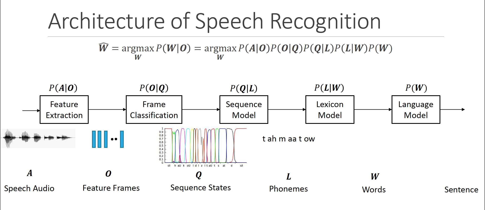

# Session 2 - Kaldi를 이용한 한국어 음성인식 구축 및 음성인식 기술의 최근 동향 

#### :: *조태영*

-------------------------

## 강의 내용 정리

### Introduction ASR system 

#### 	Characteristics of Audio and Voice signal 

* **Audio formats** 
  - PCM
    - telephone : 8 bit 8kHz
    - Cellphone : 16bit 16kHz
    - CD : 16-bit 44.1kHz 
    - HiRes: 24-bit 48kHz/96kHz/192kHz
  - Loseless Codec 
    - FLAC, ALAC, WAV 
  - **Data set은  PCM데이터를  Loseless codec으로 저장한 형태가 유리하다.** 
  - 왜냐하면, 가청 주파수 영역에서 소리 중 튀는 애가 있으면 그 주변의 소리는 마스킹(흐려진다.)영역이 되어 버린다. 그래서, 저음질로 PCM을 저장하면 다시 이를 복원했을 때, 실제 파형과 파형의 그림을 기준으로는 차이가 커진다. (MP3로 저장하면, 마스킹 영역이 거의 0이 된다. )

* **Analysis of Voice signal** 

  - Spectogram 

    - linear scale / mel scale(mel scale 이 더 파형의 특징을 잘 표현 )

  - Short-time Fourier Analysis 

    - 이 방법론은 소리가 실제로 만들어지는 원리와 연결된다고 한다. 

    - 일반적인 설정 : Window size : 25ms , Window shift : 10ms
    - $\rightarrow$ 이시간 동안은 변화가 없거나, 사람이 인지할 수 없는 정도 이다라고 한다. 

  - MFCC

    - **Formant** $\rightarrow$ 이것을 찾으면,  말을 잘 구별할 수가 있다. 

      ![](data:image/png;base64,iVBORw0KGgoAAAANSUhEUgAAAPEAAADRCAMAAAAquaQNAAAAhFBMVEX///+fn5+lpaXb29uioqLPz8/U1NSbm5v19fXg4OCrq6uvr6/4+Pjm5ub8/Pynp6ft7e3Dw8PJycm2trYAAABycnLw8PC8vLyOjo6VlZXLy8t6enqIiIhUVFRvb29mZmaCgoJdXV1AQEAuLi5OTk5ZWVkkJCQRERE1NTUYGBg6OjoeHh4cFSvYAAARrElEQVR4nO1dCZuquBKtQAhLSNiUXcBe3tw37///v5eAKCBR7Gu7dHtmPq9NBHNMpVKpqiQAL7zwwgsvvPDCCy+88Ghwa5wc/jJq+cqs2Y/uL5cJvMfyTSJfzfYaxRveACCTQsgQ+GnKwMRmfLg9TNPBw8x08LU3havFkJthDrkuqp42bghGRs0MosTLgJoJzk0NPARZwowwDwUjyErrnzg1WfZpZQg8BwEQCuxDMLJ1yTiz6kS3AMWWnSUm8bPMJODbGtJYFkGJAGfIZvdi3AS8gMYDTVCJqzTBoJGMscgxPkoHsYpq64o1DnyS0E+zptzG4OEEpb69Ai2r1zoVhWDYYKWBfCAFgzUhDcVbFJDAEg8nTAPxGcDgpZClrpGGHN2JL4AliFZhZdKCckgIFDjZkDJNCbZrQtZO4QRNrhcfpFjnrEw9M3ABkf8kUZbW0VtS5H7RvAHw1PhgkXzgp1FZCJiUWVPK/TZoiC0kof0bo6gOsiZoUHY9CpRe9nlXVJdxi1nijc+BuSzmls/AAvEShbW45Mu34jJ3XfmHKIrbq4zJ/11fyqfPXPkoUchi8QEu31vy6S7jnFvyPchXoQza582riq/hmvKSmP4Vn/Yd8EtYOfeuxO1gf0DJ7qXz7wMs/utkOkMKmCmeL8CpqbgFl4pb1CVfuOVESaoex0xI/XTHXQE3UpUEsapErRiUJV+4RV1noivvCYGV3e9RqDqzS1Q360rtGZ74wuvdArniutvYynsOuN/4/g3I1W18gFJCnhEnpPqAtfnt9bgZrPUSqf59bfz7GK9/EGWr+HW62ljSxr+P8Q8S6tfopMDva+NXP35qvPrxLH5fG/++fqwdXSHg3isI8LdYxPi//OgSutCP/ThYpquPXf6b4vp1uQ2SJYzLanqFOUjpuntsuOkiXe1O/dZx8LT6e6GunmprBLbxHdW5ARbOFqeMMfjBd1TnBljIeCrDCKIwumZA73ZYaFe7k8EIgbVaogEeEMvsasTHlrVFIU8b93uq9L1YbFeXowvUgvjjSeOsS+3qZBTrjmKI34zntDOXevZYOLmg2dnPZmyNVJfo1dhOHz3FYR6LvbdD1WUbFjhG8JwJBIsZBwMZzpkfpab9nIbmYsbDjuwBZAXQ42nzM2B5TGIg1uKt+S9xnnOKvJzxYXzSDXC8OHeSpzQzF+UIFDIp0N8rKjEa1x7gAD+j0WUtygPBg9f2jZt4QMP02Bn0BLjAl2ntUpl0AhHHoKe2MrfpkXFJNDXb/0WF8tKp/pTD00Xx43Y4IqTzZOKoeEo/9kWMA0FUJm+HTHJv8FPOnhYxznqlTDCSLKnoxuCX1c9t4yYamdDckzaIYTZXzFy/HRZ6fUZpxyELhZGNDPPnMpbz4wFlU9ogLmUIP+PwtFhzRfsYhDC+5E8QgEe976vYt2G5rt5nYpvtPErMHp3qGZX1OcaWdMR3Opl2rZwwCO1uLQ76iW3sS7a7USiKLHALMYXyOHDRvJH5w9pYtOXWb6fF/bjLSiyz6qVQS8YE108YYFQztjfCkNbadVYT+1k6gFp59tATKusTc6fDWpg1HnLmMprcFjibp3Pu5ehE7q0JadLZGOM2bp0hLeOnHJ5OtDEDnnRz/nT4oVhKctiKM6bPZ3VxZ4kPpBwu8mlJdq1urVL1D0aiuHlARxjXljAeumlpy2KnvcvqRKYA2jxkGsEir0+xpxybrdu6d15nf054cDerfx/Q9bcsmrr2+kV/ZienvcLCdaO6B/PPplQV3hOL2vgo+LBX0atGGW7bmGT7xUp9K76Ue7t31vNtpZIR9p76i5ad3Bhfyr3lB3O6LFQjcuh51r+PGGH+Su7tIHDs4KN0vh0i0wybR1TWX8ih95vDe9b8oxhzV5CGQTpfdlcsYlyl1iHgYg3NEbdM55cAsypnmq4SgDti2Zq2JkicNG9nhjwcJ91Ssp69JUw9wPojJuguXqnJ80QOyHSijIi/mr3FlLE40jzg/HlWqstonHR5Ir5EyvnA+buLwdb/PKBhPdvGWTIec4oT+Q+FPmdnCHlGoOt/Hs/MnO/H69V4Fngq2vIv3848Qq+YATZOh7LyINHmGalmJqVj38YpxnkTzRQXhAqCWj60rHUjeIQMsNl+zNjYf3WKMSngf0cX48KX/QKPB+TyITwms4yLdGw6nIyMv8XR0a4g/lvrAw3sZnAxCteP0MazmsvYjvVvcSqPiZpwNCSXYZumaoyGLtRtK3dnuOWc5rIny7fMUyrXMRidNDL/IG2XDSeMbfUWLbdDMNfGWxibh6cj48iBiW1lFLt8NxwNFDR+jOWAs/14648pnK6oR2GSA1PkO7eQFx1m1g5/XMa6lY6neacragKF9bAbBE2vHpzBsijJOHiACfMMY5IlE119mnEcRBYfmixFLmNxEonc9HIHc/7bbo6ZOiRGPeF4Jm+rktt0HXp+1shweosI9qqrTXJkD7BIam50wiQba/Aza8xNyCnkPWUxFh+k16n7D3X21v078lXWmFsRVBzCRkoy13Muk4F28HD/i5b+gifdArMWCGNsZB2daRlBUAajODVt502O3YfEZM3ujZfuGcn9ra5ZXfK+fd8Mq3ZOFqnbxd/AMOSE+JCXDBrsdKDd7QL3AFbXvF0NZTS8fo6xpBjslZI/UPQh++jekM4s4/fPo5hljFfBaGO+s/pGajavJ4qGNinedem+A99fdc0yridzg7PVbJ9ibQLOeTQ2wlG38q3PzW7tkPviClamRDd8JQ51JiNu3aZHHQbi+0+RZxn7wXh6eH5MoarZVcSa9p9eY/l3zxxReG/HHJuzs7zp+uQDulSRw/Pu3ZG5eWyB+DSKxlK9YE2miogbyTVChJ794M0QHbcxtyxrrF+W1FIl+dgmowdctimSDlcPyF5tnz0lY7cB2Cz44Pw3b4HFys11v4Tr7SyoaDw/NCEc9opLtDVHQkKq8qoj2vUYk/mm4JTGox/jErH2GGQZ064asLvi7pGK3TKQ/t/R9OGSrVOQdKOIH/Oa0+orMvbn01KJPW7VeHkGkLRbWnfMNfeAu+YOofMeDqv4GPfD5dUXM62QSdG5pu/kqnui0lm5RpPl98vde8IIN9uE/WuO4tfdBXaOcuLYYzlmS/30YmqpB1Y7CbFVm6xfjivve3tMmRDd/jP2AywV69yGhhhd/lyzuArncO2dfssJZT2UScnjMXipWCe+tapM3o4B02yMr+Mc4/aYgQsYx+mIsiQMlE9yRRaaXQhWIThJ18hX8wmeY6xpcKHeiLKDanba7meT7biFlrkFbNTGcFjQSsiJvbFYfInj/wRjDqxxIznruUxTMg37kpJP6x0zHE1y4BYNNnpUtSwT1D5G3ft5dUmS78m1MOnOqLhYohIHIRTsjavIfR+XL9Jdqbn7Xq3996iRiQXdL/dGvPmksll8YS3MF1Bk41Zdorv8Mt1Z6u4/7T/TNRlW0SWISqWmL3WtnFkLU7JOXP56c5c0Xo/dQgtWlGSbvac3aplNHEZ+mrZexC6ot9z1r6vb2BAP7QbSv97bOKSTXTjycxN9G6+2B/XRRa9GrJKWvwPahY7wW+1t7BibcSOfU4aeXSBv36hm6zUaOtP69dBOL3+LbdcbnaBhkGJcI+O02agBb/KDHMe0VaH6vjOQndTxSD7Hgni57XqrHbudcDKCVKfGZEJAa8S/Wi/HNGg1dbiTyD5pjtNW7SeZ3wcvz+JmO3bnycRrenKWL0R1JX8Rt29U1m3IAYF8SOz0djptox1NTdchGAvV9c3OhXGiiaCcMLzE9+1mmPvN7sSnP2UjCl5B2hNuA/umFvhgsGiJ/pe42T70QUAmPj3lmCdp9pZ47xSUPoHwEyPvY9VLr/4pX8nuxNQ4UR+UNnr4zfah97NoQrGLz8xANFbSByp5/92HOI+WMt+P9boz6eq+dpgtM4Zvtw99YOFJIwfzXVmMM/pqz2+/+cpBaONEoOMrh+Feo9NlknjD8ySEoT1xY0ZzcihUEdkO+mT/Np5xHHLZzf2onbiAu12krW94nkRg02gSgvRmLCVhXyX1sK/1neHYkOzconbx1v1J6ukHZnDT8yRM1uaZD0GP7IY8sh2nGV7Re8mYUm5VoY20bON1v8qi5VU3PU/CCY5GYTq54IfUgNU4vKH1fyYjwUayIewPIMCMXUBkSSPf9FwYwwiOPM8Mj1qujAy5F+cYXi8Z5kFjW4UkaXbtj3YxoJnY8BFuey6Ml9vHzvbkcAa55WAOATpy8Oy/36elzqWgl+09fSzYxx3l+HyE6sbnwvAk8J3juBNxzCAIwsL7MGRi63EnYoce6hOKECZtWx9avGh331mSzXDrc2F0MenR5+KpTIAzORHCU+3WFs/00OE1OZGUIxU5v+HyrU+mI8RkqihSIyU1IrPzSHZkNdujpwizxe5+r3M1uPmJVli0hf82V5J2hFVDzHakwJk5ll9pfMm5Seifm1Dc/kQrRCLwtaOpnd5uypDEkXJKRSrS22h2cdQIUnAyLizQM3HIe5xolUDJhIIefbGVdbuehVOrbAS7QYZhEM8MZ8xTYZ8wLCdbZ1bc3ONEq6CNUeTm3p4g66TlT5m6hXfQdZUvUtrYer7bBfAE7nKmpmHkDcjtVHBNaYVNvW1Y6xPqv1lHIa3RyALDPhWxudcpojqGXQI33zdqYPK/7D3y9rUrJ1vzofsO9zo31WRhnRxEOA6xz/56w5RaGjOt9eWoKd/tvMWktEOKM1v0S5uihLFrbL4pxicxMEsThio18h3PW9SxoftEAmwDoassRxd2Z+K3eRSpYpC673mLto4wTRoN4atlX1I5prf2NvPm9f7dz1vk8VV3V5DrMlA31+LNbDP/vBOfkRiZ486ko5sZdj+PMdQ5mPVOcIh5NDf9gYwhcfSgj3LxQJss+v+JjIGH2dtB28bE9Aau8R/JWLBE76MR1c+x50RRRClddKbm8zEWoP9xcC/PFtI8T8uy1HX5ojY2H3B7nvOgZWjjDkNf4ezOCVMUT7ihr0BYe8der4Xnpl6/NjdBEBvNUXrI3W2ub0WS8cyZOJh+qK7uITcoCgZJQ/DjGUOctQ5DhEyy2y7rpzM+hNw9h9YYITSziu8YT80Y2Dj+9vPbWCDEA5a/grGgqe2jM7+EsbA8zJ3l9WsYQ+sf3+LfoLkmON/G3PltjKH8NYxtSDaxJx2DSsaWMt9VvTWmOtldWfKFW0AZOT+5FqbnqnTQW8pppHrdgtrbryz5wi3qVjrRxnIlTHdfhLV5eI6iQHM8ZYmqQF3yhVvUJVjt3jAhe8JTUP4GPvBdtJ2oVl34BNzZRJWcW4Z8nStjNsRTL7IRQ+4C8cGeeii6Z4hCY5qj6APTwcrl6xihu7uFTLtWLC/LGueno1wkm+0UmadvHV540zoGFEyPVE5semNiHBMoHaPwoHbGddFITb3QQNgqtPGvVJIs82zs5eFklZljbOWZxJVnV964+o3e6JlDvYCY03q/g+eFjcc873SySBDPun2KQnf83DvSHpbs/poDjjdVH0YOVUVCwryJkjWhcgAnXPPzfCxPGZRFxTDgaOJ7chnmka17kAaTPAnLSMKsEc8LrOlRXLua4aOaTRn7inLk+Tk61pfyEtbAwdOiNielDAyGJozjrbiEExf5wYRxuLbanFPBeFwJA2pOdR1Bmkw8V4bM4BMSIRiPb9HfK4LakqOaTRDXcwshrbrS17WLj6NZHgSbIN36wfSIL2b4dc3WFTST5bkp8siGxnUhZGAs1bXjVTXLN1E8OYIGpw5UNU8/majE+BYcorTQN45VT9M0ExBfo21sY/OcZ7A/HUioSLzyeQxSs1mPt4v93yH1FYNe5YftTgn5cwYG1Fhj2/TWa71O6zB2jKaOsiogjQubeO2siFnGzb2reGUguUbpT2Ro4AWuVjbU45pVpXL/ohwiMP2njYWo4MhdJAqNFVlNsne9oZFLoZInK/sGJMY68h/xIJ3r4DBsMplt3nff5AF2u/4mHDJH2VA933+P3BdeeOGFF1544YUXXnjhhVn8H30exKPp6iiGAAAAAElFTkSuQmCC)

      - Shape of oral cavity is losely related to the location of formant, then  How can we analze the location of Formant from Short-Time-Fourier-Transfomation? 

        $\rightarrow$  **MFCC**

    - **MFCC** - 구강구조와 관련된 Formant를 찾기 위한 

      - Feature of speech data

      - Spectral envelope 

      - **Homomorphic filtering, Deconvolution** 

        우리는 저주파 영역은 촘촘히 듣고, 고주파 영역은 듬성듬성 듣는다. - 이를 분리한다. 

      **MFCC Computation** 

      

      * 보통 13개의 MFCC를 찾는다. 

        -Other features: PLP, LPC

        • For ASR system, MFCC > LPC but sometimes,

           PLP is slightly better than MFCC

* **ASR System**

  § 안녕하세요 반갑습니다.  = $\arg \max_w P(W|O)$ 

  :: $ W = w_1, w_2, \cdots , w_N \rightarrow Word \ sequence \ in \ Language \ Model$ 

  :: $O = o_1, o_2, \cdots, o_T \rightarrow Observation \  sequence  \ (MFCC vectors) $ 

  **¶ View of Bayes` Rule** 

  $ \arg  \max_w P(W|O) = \arg \max_w \dfrac{P(O|W) \dot\  P(W)}{P(O)}$

  :: $P(W|O)$ = Posterior Probability ; ASR output( most probable word sequence)

  :: $\arg \max_w$ = Decoding Process 

  :: $P(O|W)$ = Acoustic model 

  :: $P(W)$ = Language Model 

  정성적으로, 이런 음파가 왔을 때, 가장 가능성이 높은 단어를 선택하는 것 

  * ASR System Architecture : Pronunciation Lexicon

    $\arg \max_w P(O|L) \dot\ P(L|W) \dot\ P(W)$

    발음을 고려 

  **¶ HCLG in Kaldi** 

  H : HMM structure

  C : Context-dependent relabeling 

  L : Lexicon (영어는 어렵고, 한국어는 비교적 만들기 수월)

  G : Probabilistic grammar or language model acceptor 

  Create these and compose these together (가장 전통적인 모델 구조)

  ​	$ \arg \max_G P(O|H) \dot\ P(H|C) \dot\ P(C|L) \dot\ P(L|G) \dot\ P(G) $

  :: $P(O|H) \dot\ P(H|C) \dot\ P(C|L) \rightarrow$ Acoustic Model 

  :: $ P(L|G) \dot\ P(G) \rightarrow$ Language Model 

  - Decoding with wFST

    

    ​

* **HMM 을 DNN으로 대체하고나서는 받아쓰기 영역에서 인간을 뛰어 넘었다.** 

  (강의 자료의 사진이 이 구조를 아주 잘 설명해주고 있었다. 그러나 비슷한 그림을 찾을 수 없었다. )

### Acoustic model design : HMM/ GMM $\rightarrow$ HMM/DNN

* Frame Classification : GMM(Gaussian Mixture, 어떠한 가우시안 분포를 써야, 데이터를 만들수 있는가)

  ; uncorrelate 조건을 많이 사용한다. (공분산 행렬의 비 대각 성분은 : 0)

* Sequence Model : HMM (Hidden Markov Model, generative)

  -HMM 을 사용하여, 확실히 좋아졌던 예, 

  **Forced-alignment by Viterbi decoding** 

  

  - 음성의 단위를 시간 순으로 놓고, 역으로 가장 가능성이 있는 path를 찾아 Sequence를 Decode한다.

    Decode라는 것은 무작위성을 인정하고, 어떤 분포를 따라서 데이터가 샘플링 됬을 것인지를 해부하는 것 

* **Context0dependent Phone Models** (문맥 상에서의 음소의 다양성)

  - Triphone Model - 음소를 음성의 단위로 다 쪼개어 분석 (모든 것을 다 쪼개면 모델링 불가능)
  - Kaldi에서는 언어학자들이 만든 Phonetic decision tree를 이용한다. 

* **GMM to DNN** (HMM/GMM $\rightarrow$ HMM/DNN)

  : DNN이 Classifing 하는 기능에 있어서는 제일 좋음 -> **Acoustic score를 추정하는 것을 DNN이 수행**

* DNN이 수행하는 여러 기능과 그 설명에 대해서는 이 링크를 참조 [Link](http://slazebni.cs.illinois.edu/spring17/lec26_audio.pdf)

  ​

### Toward End-to-end ASR system 

: 크게 두가지 흐름이 있다. 1. Lexicon없애기 (CTC), 2. HMM/DNN + wFST for real time ASR(ex; Kaldi, 2018년 기준으로는 kaldi도 End to End)

* **RNN-CTC**

  -DNN = RNN, HMM $\rightarrow$ CTC

  • **CTC = Function (모델도 아니다. )**

  $ p(\pi | x) = \prod_{t=1}^{T} y^t_{\pi t } = \prod^T_{t=1} p(s_t|x_t)$

  CTC에 대한 전문적인 내용은 아래 링크의 논문 참조  (강연에서는 부분적으로만 설명됨)

  [Link](http://people.csail.mit.edu/jrg/meetings/CTC-Dec07.pdf)

  CTC는 Decoding이 어렵다. -> 여러가지 최적화 방법을 사용 

  - Prefix search 
  - Beam search 
  - wFST + Lexicon + LM (kaldi와 비슷한 접근 방식)

  -Handling OOV(Out Of Vocaburary) with character-level LM

  (성능은 좋으나, 느리다.)

  -> 앤샌 project(Decoding with wFST) - 실무에 쓸 정도의 속도 (프로젝트 진행자의 이른 죽음)

* **TDNN-Chain : Kaldi ASR Approach**  (TDNN - LSTM)

  ; Time Delay Neural Network

  .jpg)

  * Recent researches in Kaldi 
    - End to End training(2018, 03)
    - TDNN + LSTM with chain 
    - Chain 
    - TDNN 

### Data driven way of Korean language model design in project Zeroth 

- Language Model 

  ; 음성인식을 하고, 결과물이 말이 되게끔 만들어 주어야한다. 

  Mono-phone with boundary information - Monophone - Lexicon - **LM**

- N-gram statistic Language Model 

  - Goal  : 가장 말이 되는(가능성이 큰) 문장이나 단어 선택 
  - N-gram -> 지금까지 나온 말들 다음에 올 단어나 문장을 선택 
  - Usually, bi-gram or triple-gram 
  - Loss - Perplexity 
  - 이 후에 나온 예시들이 이해를 많이 도왔다. (비슷한 자료를 찾을 수 없었다.)
  - **Unknown 처리에 신경써야함** by Data sparsity 
    - Smoothing 처리 (확률적 모형을 쓰기 때문에 가능) -> Kneser-Ney smoothing

- 한국어 Language Model - 한국어의 morphological한 특성 때문에 만들기 까다롭다. 

  - Preprocessing 

    기존의 형태소 분석기 보다, 이제는 **형태소 분석도 Data driven approach**

    한국어는 글자와 발음이 일정하다는 장점이 있지만, 

    숫자를 읽는 방법이 다양하다거나, 외래어를 읽는 방식이 다양하다는 특성이 있음(ex; SBS, TV ; 이런건 그냥 단어 소리나는 대로 라벨링)

  - Zipf`s law - 전체 단어의 20%가량이 전체 사용량의 90%이상을 차지 한다. 

- **Zeroth Project**

  [Zeroth project Github](https://github.com/goodatlas/zeroth)

  1시간의 음성 데이터 제공 -> 51 시간의 음성 데이터를 받을 수 있다. 

  (왠만한 모델은 만들어 볼 수 있다고 한다. )

  * To  do 
    - End to end training 
    - GPU-based wFST decoding 
    - RNN-LM

