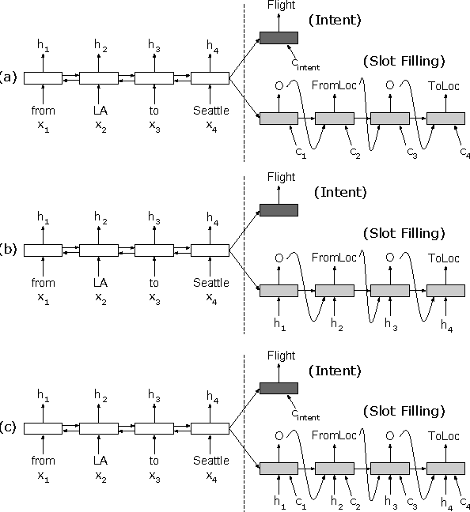
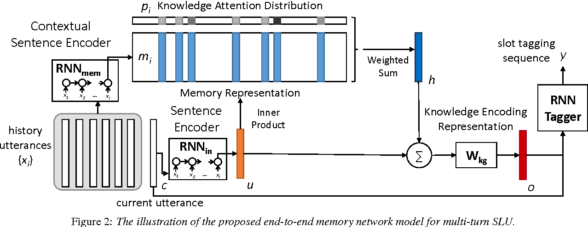
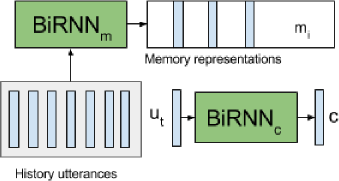

# Session 4 - 대화형 시스템을 위한 자연어처리 기술

#### :: *김종대*

------

## 강의 내용 정리

### Dialogue System 

- 어플리케이션은 GUI를 넘어 CUI(Conversational User Interface)   

딱 딱 구분 되지는 않지만, rough하게 두가지 하위 기준으로 나뉠 수 있다. 

- 대화 범위 - Closed Domain VS Open Domain
- 대화 유형 - Task Oriented or Question and Answering or Chit-chat(가벼운 대화)

**Task oriented** 

​	- 한정된 도메인 지식 내에서 특정 목적 을 달성하기 위해 대화를 진행

​	- Rule based 로도 구축이 가능  (그러나, 한정된 도메인 탓에 모든 걸 해주는 것들에 비해 경쟁력이 없다. )

​	- 다른 API와 결합하기 쉬움 

**Chit-chat**

​	- 정해진 주제없이 대화를 진행 

​	- 검색방식으로 접근 가능 

​	- 최근에는 seq to seq 모델로 구현되려하는 추세 

​	- 다른 API와 결합하기 힘듦

### Main Approaches 

- Mudular 방식 으로 크게 3~4가지 하위 모듈이 존재

  Speech Recognition - **Language Understanding(LU)** - **Dialogue Management(DM)** - **Natural Language Generation** 

- NLU(Natural Language Understanding)

  - 유저의 말을 이해하고 의미와 구조를 추출하는 분야, 핵심은 뒤의 **시스템이 이용 할 수 있는 형태로 구조화**

  **Domain - Intent - Slot  **

**Pipeline** 

​	1 . Domain Classification - 2. Intent Classification - 3. Slot Filling 

#### Domain  / Intent Classification 

* 대화는 **문장의 시퀸스**로 이루어져있다. ( 이전의 대화내용이 이번 대화의 분류에 영향을 미침 )

1 . Utterance(한 스텝의 발언 : 문장)을 하나의 고정된 벡터로 표현 (Sentence Embedding)

2 . 이전 발언(History) 들을 함께 인풋으로 넣고, 현 스텝의 Domain/Intent 분류 

**Embedding model = LSTM**/RNN

Polling 사용 - 문장 길에 따라 나오는 Hidden state의 개수가 다름, 하나의 고정된 차원의 Sentence Embedding 을 얻기 위해, Pooling 사용 (**Max pooling**)

Classifier : CNN - History의 개수를 다르게 넣는 방법으로 여러조건을 실험 

**Hyper-parameters** - Choice - Eperiment Range

LSTM output dim. - 100 - 50 ~ 1000 

LSTM Pooling - Max - [Max, Mean, Last]

LSTM direction - Unidir. - Uni/bi

CNN num. of filters - 500 - 50 ~ 1000 

CNN filter height - 3 - 1 ~ 10 

Dropout rate - 0.5 - 0 ~ 1 

Word vector dim - 200, 300 - 25 ~ 300 

: : Datasets(DSTC4(대회 열리면 참가해서 받으세요.), MRDA, SwDA )의 결과 비교 해보면, 첫번째 layer에서 많은 history를 반영 했을 때, 분류 성능이 좋았다. 

* 바로 전 스텝에서의 도메인 정보를 이번 스텝의 인풋에 Concat해서 반영 시도, 

  $\rightarrow$ 이전 턴의 도메인을 같이 사용 했을 때, 모든 경우에서 성능이 개선 되었고, 대화가 길어질수록 효과가 더욱 극대화 

:: 제안된 두 모델 모두 Context 정보로서 이전 대화의 내용을 현재 문장을 판별하기 위해 사용하지만, 고정 된 수의 History를 사용한다는 점에서 대화레벨의 Long term dependency 를 파악할 수 없다는 한계가 있음

#### Slot Filling as Sequence tagging 

: Slot filling을 Sequence tagging 문제로 접근

**Many to Many RNN Tagger** 

- BIO tag Format 

  B : Slot-value의 시작 , I : B로 시작한 Slot-value에 속함, O : Slot-value가 아님 

- example 

  X : 부산 송도(Region) 맛집, 볼거리 3 만원 이하(Price) 로 

  y : B-Region I-Region ooo B-Price I-Price I-Price 0

**Bi-LSTM-CRF** (CRF : Conditional Random Field ;실험 level에서 80%정도 Accuracy ; class가 10개 이하인 경우) - Output score는 **Likelihood**, Label bias를 위해 Global Normalization 계산 

​	:: **LL = (Transition Score + Output Score ) - Normalization Score** 

 - **Hand crafted 된 feature**(Spelling feature, Context Features .. etc)를 넣어 주었을 때, 성정이 많이

   올랐다. (Senna(인명사전) and Gazetteer(지명사전))

### Multi-Task Learning for NLU 

: Domain/Intent classification과 Slot filling을 하나의 모델이 수행 

:: Encoder - Bi-directional LSTM , Decoder : LSTM, Aligned input , Context vector by Attention

:: General Attention : 인코더의 Hidden state들의 가중합 

**:: Domain/Intent classification과 slot filling 모두 다 성능 향상** 

:: Joint NLU구현 (pytorch) - https://github.com/DSKSD/RNN-for-Join_NLU

### Contextual NLU 

: : Context(history) 정보 활용  + Multi task Learning 

**Using Memory Network** - Memory Network as Dialogue History Encoder (; memory 하나 = Sentence Vector 하나)

:: history utterances : 이전 대화 히스토리를 인코딩해서 external memory에 write

:: RNN_in : 이번 턴의 유저 발언 역시 같은 RNN으로 인코딩 

:: Inner product : 현재 유저 발언과 대화 히스토리 간의 Attention을 이용한 memory read

:: Summation 뒷 부분 : 메모리 읽어서 만든 History vector **h** 와 이번 턴의 유저발언 vector **u** 를 더하고 Linear   transform - 최종적으로 Knowledge Encoding Representation **o** 

:: RNN tagger : Knowledge encoding representation **o** 를 이용한 slot filling, Intent Detection 수행 

 * Knowledge Encoding Representation **o** : ![](data:image/png;base64,iVBORw0KGgoAAAANSUhEUgAAASoAAACpCAMAAACrt4DfAAAA4VBMVEX///8AAAC+AADi4uJwcHC6AABbW1tXV1fs7OxeXl5UVFTHPz/Ra2u5AAD4+PiSkpLNzc3OYWHx19fDw8Pz8/PV1dVoaGjFLy/Kysrp6emBgYGHh4f47OyPj49MTEyysrKtra06Ojrz3t66urqgoKDLVFTjq6vsycksLCzc3NzOXl4qKiqkpKQfHx91dXVFRUXVfX02NjYQEBDdmZnbkJAZGRnScXH25ubWf3/gpKTltLTqwsLEKCjuz8/ZiorBFhbJSkoaBgZyAAAoNjbBExN9AADNAACvAADELCygAAA2KioLayAbAAAXIklEQVR4nO1dCXPquLK2DAYDsdlsJ+xmSQJhcSB7CEneTN7cue///6Cnlle8L9JU3brpU+UcjFBbn7pbrVZL5rgMVNZkfF2hcpYfZaWWCNdet8Sg7i48P1fqigzqPqcdgudXUY8lk6clXCdow6BuVIHrCF0xqNvPagEXxJRHk1S/27OoW4O65SpTrbAIbeHCor9d6qEBMKmyqLuLdKx/hAFr6iKVa66Z6h8n1zWOm7NR8t5yYYsta2phDewz6W8PNbEpqTHq+BrugoPOpm4f1ccrYhP77hjSVyjzKKFWacsIqiuktNCETd0+kpFOxBfZQ/lgjKiPvBpSCZNBjXbNHDc19Dr8rTbde+KGhUoqCGziSkOVOfks1xX6UK1QjTz7SKNdMzghYwJVxYVKOSyYWK8J0uGPI1UcA6h6U7TCf0bGcke7ak7dInBDd2sDsCLGRGyVmEC12BOHlylU3AAPtJiaDKSKqyNiW2vgIXKoRe6tWEAloyn5i6FSmgvoGAZQKUaf/GWhgKUnnfwFBdxsUH8BTiITqMpENQhUcqkHosUAqjmZFLCBaoFMIwtQ9RQ074H/xgSqrk70z6OAMqLtLDgzJwZQyWhp/sccAa3JIBOobLqqmZ3DaWX8j3Llstkd3MRQKdeM67b+jsqgHhVgILd0pLaoc/pnqcvQWZx37f/Jk3l3PmfH6Zd+6ZeCJOv/EKPSgjEDeSknFypCK7bBXJfq9H2Ec9KRzpaBwSZ6GKAuQgym/R6Sp8hgKlZzhP6JEDt2SBDarlgygJYwHcDrmEGFJQOLVpgP2wg1MGDpQ6uEAYsFNB+VWbdkQxgwXO+oEQbsl26ukKqhgcHOLIrT8R7tjT2zoWOOVlWkqaibXLQYjSfYWCnylP4UzaLuATOoyTqzluCJzBgPTCvGwzihCoOI3hnVWY/lY8ZjuEO/UKWmX6hS0y9UqekXqtT0C1Vq+oUqNf1ClZr+86HSfqFKS8ovVGlJ/IUqLf1ClZp+oYogRbPXTbpWZhUrqFp2FKxnxdvoQqUiazFfRHaLaEvVxsprFNHYZsVIqgxkLgrodiYJXamqWgtAc6Rbd2hDpVtQ9axcHnZQ2ck2mmF+pgyV3ZDy0r5D3VbtzQC3Ya/KMYPKqli2FZEyVLKlFu4iCnWorCee2kmgzKCSa2tY3tDtPqFt1rUn0AtPZj91qErEHurO2ga7EXBOQvbVNSOoukQDtS07qLhBHZvb0db+yNBZONRh/c8eoKg7C/sxJGqOnM8MoILVZHcdliFUO2wW5wf7E3Wo+ggWzdzPDFxQ1PRu0GMIVQlr+XRtf6IOVQ83xGAMFeIqbiY8Q6jE6c6TLUsdKsXQOORJg2AA1Qp1p66Gs5zYDJ6qDKHimqiCPGuwDKCCPAU3u4YlVJiT2yf0ocLV9z0fWUyXd948C6bT5XrdzbdgMF2u1b2ZgCygkhXPwvtvZCE1/UKVmn6hSk2/UKWmfwyqGusM4yrrTM1/ZsVG1CdTtGCXKIanOJjBdMIsA7il6/oCGRNd37BLY5Z7St3YI5PG0y79NHlRHBtjm4ExFmkruiw2jQNyaDpV2aT6z2sWh+bc+s+gmfyrLLSw6l1Mmvb/qNY/qUKd9YlFhMOIeqaxTDKYp7UW2bEn40tFI7BR49ADoAyLAVxaNQPAotXvpAUHzfPAslKpQKox5SR8kKiyT+XmIF19Sr3SX+PKJucaJ+r43rIf8YuMBHn9u0Cybxf6m6bhVTFS/TDD0ceMWjSsI1aNaZiEjqaUNi5gpPahDzrHkqXT4GDWhiJrUw9UmoK7Qg+34SBZFEb2akBkz5hrlAaQSZyMKnhILOwwVuKUoEuhM+qx+48w+2lRDoTwo2oxtlWZF+523K1xO5VxVxXcTV5J2N+kUdr/pCU9qIYOhWx7rEwBzQvKVTXRctdoYCVriXyULUIFBtxy8mPOC+0eUlPggFtZ+AyBbrxyEBK3dt5EDlptkZFYyEDr/II7TvN0FHIeU3mZSgH5HaFp8uxbmeZ3dkcozfS+W3iHoI4OacbRXX6xSrf1b5F/C+J53D6SDqjYMVDKOB2fVm5V19A6uRCmbV5r1UKHVBvySgWtVcsVy3rsoxo5x3P1yTdoyBG+fxc95Rs6NFvgm/V4/SgX2/o9cNe00DauYA8ZuRzeFhqfGRI1Sg2wfOfardkz7JitlmCM+sW2GXvCIGgZV7B3yNcna5+5ViMVvplSU310hQ6W/6wlnEMhexdVc/BxgY6HCtvdXLbEv7k+GqpBvk4vO52dBFXgWQjXxDFntyPCOjiHqrRSI3EfZWyJah2x5vtVNFRZz0/W54r5K1tsMVSKGhf2NDwr6DZhH+Iq3tVYYYQhecujHmhagpMcovzRUsaWlE1MglANuF0/1F5lZCA+GRvyK7v92FYtEVpHHxGhhvluNQibxjJqkahd0zN+IrSVMYTVKLk6ZNQPPJUYlAJapaLyeLczwjzarAdhLEhABD15GLaglki5ukKRZBcpaWU/7SBmiLaGF6qtQmaEUc4HQrtANTG0W5sMAlAhHRzfkLkOQtNsHKAJFeRk0GnELdGjNTwFVK3oIl6oiFkfxECVj/xQEdGZhojoKl/9Hqh6LoNwqOrNAMEK1dJRTLkUILImsC71M0ElBuuJph500HQbYdb3IVAZaNfLwgCEZN31Q9WKgyrEVtXRehPrMWI21TmY9fRQZbRV4hY9bYJuXwxUKedyNpWe0HYDv7I910So1JARsJ44Q22aZ02OPAEYFyrN+XXJcMxv1vksmpJjRmOgWvkGkKzOwtJi4HEWOBOqed1TrvRkY/kUApWYNudgEHBB4YhhJ22sWXlyoGxmbYl1Hms0VP6JTEYGJZPBIASqieflE7udoyeFzpqaeKEiSo+tV3lrWOgvuKUHquQAXQj5w2EOVEoLbc7mbFl9XIuunElljcwBMVQb40DeNENCtwv73GdOLDoHdDSsS2pcdRXOk+u4tqESp/nmgIsAVKRlWyR20eIslNDMtyrvhuxU8iYbpbuypco+k9mCquB0WQtRX86Tt+lA1UPLXEHEVnRY/vyLVd5wUjkY8NYBqskcLcixs1a9ci1d6MKOEjl/rfsq2gadW4BqV9agJQ5U5dB4la/akFhUHFRnT66GQFUxw+Erq+8mId0KAdrAPJ9A1VLRRAUWVr0WgwggPExNKW1ZMqjaotibhoj92L1l2yo8MocF163qBtYw3w+BsxwZBzuH6ikkcmFVj0yllavhK2DBiLQepoAI7XuwIVWHD72tFeUKxrj65nPtrOd23Zqm68I5VB5YPllPPCx6slnsKVAM0+HJegrS36WwOE30CsaZuE3C1hLmJghWLLkX4Xct0MEnG3PzdTxPAENJRBMYLCdmtMo6731usRuEhANNKe1bDptn1AzLcVpYsjRZ6JsF1CVHtLdrGm2ExgBuKdTa7KLW8cuaJ5RcDYuOXpEuUK35V9QLMXprpPtuzRcOeBtogwi+psnA3H3ctUSxHBIdWE4J0/IB2uYNKExSmFO5HrFgoxKcm1uNSEiYC06UfhwerVCc2/IYhdpcDcSpWeWI5d5HBTH7ySltimEz2JkvoKlMoUWhU505AIJNVA0W5UaepQFxmbx0PI5cgCbVDcoc0Y11eLd3kxcRJxHZGaQLFlXTaE0j5z1aYlqQjlzvikS5RB2guwpzSltQ2QZhKe5xsnZmU6YJ/oZsRAveAltHWdO48QEeIgLPabjIuKRGZqpgcephkWkh94SAMFpHCa5FLZeBsq+BZ1IiL1IKf0VXfS+T99phqFbndkH+8w8trilGnFRgccJ8seQA34hiyp9//E8cA4zUMmIqhkcTkey7nOM5X/R0rfvH/471WAZumtoC9xvIyn4SNZeCjfVYyuFdE7634Aw//orpdjAj0Svp8EIXqG6OlX4Rmc3yjhnMo+qApKTI059ra6ycMldaj7hydIrUyxv/72h7JWOp9kzKmlj4y3i4WCK/F2yTCuqJ9ai55GpnUA2/+L/+L1LFAKnIVgLjPfbZoFhTOUQs6Qy/+b+WKHIKaURlJgLNUZfkRZYPq+jexC3g//0nQvXQ+QQgNfUwkNGcbNNuIXkTXqeIKk1oi44ma69NuRB4nocBYhxiClYjlDBA4uq2ZDs9UiMsHjSEMAiN9k/qMTKF/Y+tbugcDA2ryN0sbx+YwRFykw7B2NNqgFuwOetrZD4q9gIHEQNFsz4gzvR0sXVtyss9ICVgU3bABsO3tNXT8M1xQvLVdPEE1YloHj6WP/8QBjLELJfqeb+XVCxt6CrOIte2B/IAaPkULtsvF5LZAm6AK9uvSy4LudSrQQt8gys2fNbL5HYRerCw5MMgDr5FknT7jRnhh1UhmbjWdAbP7gjS8LeJuUJWdTIKX2G/li6+zZaoZNnAZcANQGRRP35wHNtvt4oyRf96PDZMBlzPPHN70RzJ5PlJ4v0+0ALVCgw1Iy30XDMnnwPtzO2aPQsEKvzTsj/CX02R8G1VJ9e0iCDNO8/fkZZwilbzMahpFDY+uQywN1queuuflkNaUNI0Ink2IKnp+fH0Llkq0Dpb21nQ2TEkN6SOZH+42ngYbOgweJdeXxwGnNxtGfbz090l1BG+uOG/zqxFNVErMjGQ3jnu84xBf4n29F4TcLp9uOVez+3dFYuXT1zwl5zcObs1p/q+A2DAvZzfq6Mnen1xJ70GGExTJLhmpZMgzPz3YHmNmuRiBi/+e7D5gto7J29DGJA9W7QY2HTBP/tvkXGJ2uazD/4+cO8JONDaCvjFv4YzoLxB7/bt5uS71Zsimn0iCR3/LXO3IaW36R0FPsDA3Ai4p7tr8lnyIwUT+BpSD5QU5OI09N+SjeUarfd03skjn9oXQQYVFVW4PdVtmTNBuPXfw4JbQUovX2JmkIEUYDAfiBVUE0dUNr10gvVzpTnZEa9QNexfQUsFRO/wgJ8QS8VRPDxgyIe3gPrhAUdeCgx/QNSgOvLB0QmIGlSPvBBQcCDaUMnvcnDwAKIG1aPQDr1PC6qZxN+FfkEbqpn0Gf4FLajk2U3QkgDRgmr4GrDpJtGGqsFfh39BC6pLIYIBJahm4YaKow7VMULPqUH1HsmAElSf/FfEN5Sh+hai+oQSVNeRnU4HKlkS3iO+ogvVy0073JDQgmoo/QT8W4voQPXNf0d9RRWqGd/whikmZTPOOoAQKiWpem1EfUMHqpN0dD+UyqbHOSdndVCF6pOXvC6PnS1LcmOpQHWUPOo3spYIt+bcMgtUb5JkDw6PkrfOe97b1/aGlBGZMOWC6rN9Z6vBc/vOnVlK5360DdU2M1TDuwu7KS93bdePangZNK2F52l2qG74ny/zsYcf3iiCLPFvnmJ2unoBqL5523rPeM+M74LnzwxJAagE3p5zPwg8b9++PZvxF4FKOH6YoA+lmeDC3+b/9hajANW1cJTMIfvt+tGFatY4d3mKQNX+tFxm/t2F6vrMaSsG1bUZOW//dFyoTrxw1tdUoDpJplZcXz84UN1LviBPEaguHs3pfUe4daAavp9NLwtB9f5C7HeHf/dI1a10fRY9pwKV/EkqPUlDR6rwhNw34y8C1R0n3MD/7q85B6qvy7NCxaAa/oANueFvZ4Jtqz4vfI4IJahIp39LsgMVnpD7QgoFoYJluKHkQnV0NZFQMai41w88Wn83OEcBhw3h8bwYFaiGnPAAw8cbZ0M1EwKzv2JQncDxOEqyA1XbN+MvCBUnvYFWuFDdCH/7ojuUoLrBZvHmZ+hC5TOJXFGo5GusGJefnA1VW/BF1JtWeDgvVAJPGuJAxQfWHlp0oOpI95x0ydlQzRrBGU3XXHhokhN/MkPFPUuzG+nGgeqt4Zv9jcyG9HK4oASqk3B7+cY5UJ0EyV+sNyW5UiW0hWlHbqi4i3sZ7JUF1SMfYARu+kZWzBd35IBqKHVuPmQbqpvrd19IQbZ7wszqyQ4VL0D1HdOsD79PwejtCNVlRbYePT9Uz7wAo6AJ1VDiQwJiIjmI0mSQHSrs/AvgOxOohpJw9JcaIEPfLJBufsoEFUgrdpkh3gLqgektNLi6gB3A1sbl/FDhlmDLbkHV9jnqNomYTFclB1Q3ZmyKQNUOCxkqhmFMdetDFqiODcBdvgTjN2tAM+QPPjR8q+AGFHk7UoP46vfEIfwkrlwjKjbpUDaopG+4ft0BzBJW7c5XUKh8VCyy8BZmQM6JTmTh1HmIiE06VCyycOIvk4oUg+qSqGQs0YFKEhIZFYPq+ZjUFcWgepeTGVCB6o6PjE06VAiqayFRqApB9S5IiUhRgarzxX8nFioCVecnuLYfoCJQNSIXNzxEA6qjlKJPqgWguuevk/PlCkB1658IhBIFqIYvt4/JpXbr/FDxkasoHioAVTtx/AaiANW9wCcXKkLHmxRIcWNUTy4USsObmzRJnsWh6vBRC8qUqBOSbRhC/WreZFP+6yFNseJQPQfiVJTpgr9j9z4GjsTBUjWgOFRCSN4kTXoR+DT6l5vkNh+eWuOnXm4Nt+kmxThbhF4Zm8JOSGZpKMlXxV5y8EJma6FkJgOWSKiyNcm7mUN+e2TbFe+PSbNLStTm+SjvkGyQk83TTrXcub/XjXib29fhSs446hk5klpvfiIHpQ0ZJ3akx43CKb+zn7A4lUnkpBbzhABxGnpGRgrq8AkhhTG4tuZ7/Ho5sr3DA20mkY3runl4QpEDz016iJsR7DRyRiOSuVaq05nD6JP/iC+wg5YMyNEQ9RxQ3UUE2oDIBto5OUlnVDw5ehiZ7sSRs5i4cXmD4GCSvPWHBD/PSca9IBrkqI9ldiU58XGzSwh11xAcB9GvF904dx3dJYSVzlU3Cpbd3MPs6SJpziQvx3DUg9bkNjmOb7+9ixPaKsI90VvU485oTUmdLz4y3QkIyy5qcuVaN6/4nr6SfbYNUkuIq+xlfZl9lnkfO7yqGHwkLtBqVfQEeu6Vl2L9aBW1Dhy3GGvkxQMH3b7fTftqoXshtisItVAXJspIJeemiJleWvQdX39pPdKmCvdknsosnwmtms3OS+Ghe4euUH1J9jcTI7LUrdtaMyVUcipHfTknLyivEtHtZrGKp5/AMu859cnO4K15IqPo3XKuHbKppBTc4HRGvTURXHL4izw4VHTzNpbqdFBdx+u3RWtytlqNDOpXfaSnN8DPSXGwHdnFPiKHy6yaCA5IKhE3q9zdZZucvyT50SI5EbFnKvrecwZmKqiG95dpphwqOYy5uwb/U9RRL/3c+jJJaJU1KHVvDVqhtJCqgPMAX4hcmeKm2QAts0IlfaabnHkpiwKmi4M5JFqHVJmfmEOllcnrpVJB9cnnCClkgOokhG+ciiKAaqXV0Y6cJsYUqnU2qXq55HOEFDJA1c4YB8sjVben2+yagW2kfXrA1RVqdhON75twmSOkkB6q16xxMHOKOc8A1exCEoS4+UwkdW2ouq2rZKh4Id4TCSdlnPatfZ+Z42C7Ch4ORZIzppfX+3Li5EAAX+RTShc5zE+z21QB79x0PA7TROwLkSm29wkuVVEa/gQ3i1MlPjlJoTCZ4dXHFOu9RehB+Ga69vCQnPlSnM6hum40GpedS+d68Y6vl2+vcOOEL42P4Q3c557x5Z772yn4fQvXzwcofmz7amlzX/xH44H7cO48m/Xe+wp6a3kf4tr/nh3hzqNZ752v+LPzdB/JCSm0oYLDw4ST4Fy/3/BVeIRj0SA5n+elIWz9gAxVXmhzbkHhCEWeP+H6fumvBX6Dzbrkq/ehLZwX5D21vL3AdfYO1/vX8HrdWhpsI/aETFv1bNmq+4uLi/as7Vw/j/jafn+AGx18ubiT3+E+94gvD9ydU/C5AwXfbuB6++qr5ZV7xv+98RT31usp+HxyazkOcfH2y62n3pinYztoWFBBXPI+m6P730n/D92duJ9AcvHDAAAAAElFTkSuQmCC)

:::: Intent Detection에서 단순한 encoder-Tagger보다 결과가 나쁘지만, Memory 의 재사용 덕에 속도가 10배 빠름(그렇다고 주장. ) 

**Sequential Dialogue Encoder Network** 

:: 이전 Work 와 유사하게 , History, current utterance 인코딩 

:: c(현재 발언)과 m(이전 대화) 간의 attention을 통한 가중합을 통해 History vector를 만들어내는 Memory Network와는 달리 **SDEN** 은 가 m, c를 concat하고 2 layers FFN을 통해 128(hyper parameter)의 벡터를 만들어 낸다. 

:: 각 g를 또다른 Bidirectional GRU에 인풋으로 넣어서 마지막 히든 스테이트를 History vector로 사용한다.(Session Encoder)

:: $S^2_b +(concat) S^2_f= U S^2$

:: $P^{domain} = Softmax(Us^2)$

:: $P^{intent} = Sigmoid(Vs^2)$

:: $P_i^{slot} = softmax(So_i^2) \  for \ \ 0 \leq i \leq n^t$

- lessons 

   - Slot 을 잘 찾는 게 중요하다. 

     Intent를 잘못 예측 했을 때보다, Slot을 잘못 파싱 했을 때, 대화 성공확률의 분산이 큼. 

### Challenges & Conclusion  

End2End trainable Task-Oriented Bot 

 	1. Issuing API calls 
		2. Updating API calls 
		3. Displaying options 
		4. Providing extra-information 
		5. Conducting full dialogs 

- NLU가 파싱한 Semantic Frame을 가지고 Bot이 뭔가 Action을 해야함 

- NLU의 결과를 Implicit하게 표현하고 아예 System Action까지 분류하도록 Jointly Training (multi task)

- **Generated Response** 까지 필요 

- End2End trainable Task-Oriented Bot  

  API 호출 결과와 Raw text를 적절히 동시에 만들어 낼 수 있는 모델 but Data를 너무 단순하게 가정하고 해서 욕먹었다고 한다. 

#### Conclusion

; **지금까지 나온 논문들을 모두 구현해봐도, 실제의 data, Task에서는 아직 실용적일 만한 레벨의 딥러닝 기반 Chatbot은 구현하기 힘들다**. 

